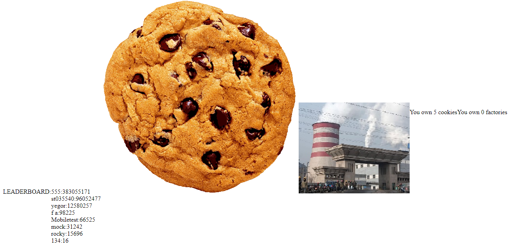

This is a simple cookie-clicker implementation that is written for the Grid&Cloud course in SPSU (in one day).

Deployment:

//assuming that you have rabbitmq and tomcat7 installed

There are 3 dynamic web projects, you have to import each one, add the following dependencies: 

[

 - servlet-api.jar - is packaged with eclipse or whatever;
 - amqp-client-5.1.2.jar - rabbitMQ lib
 - slfj4-api-1.7.25.jar - rabbitMQ dependency
 
], 
add them in 'Deployment Assembly' of the projects (see Waliaula Makokha's answer at https://stackoverflow.com/questions/10088604/how-to-include-dependencies-in-war-file )
 and build everything into .war files.
 
Put these .war files into you tomcat app folder (/var/lib/tomcat7/webapps), start rabbitMQ and tomcat and you are done.

Entry is located at site:port/cookieGate/login.jsp